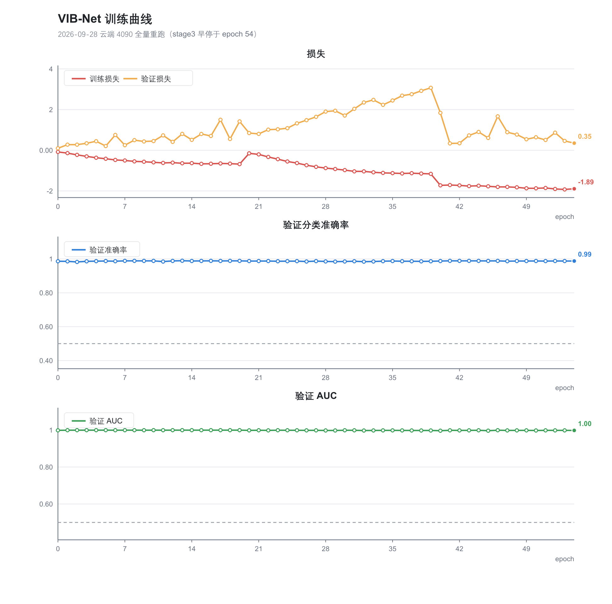
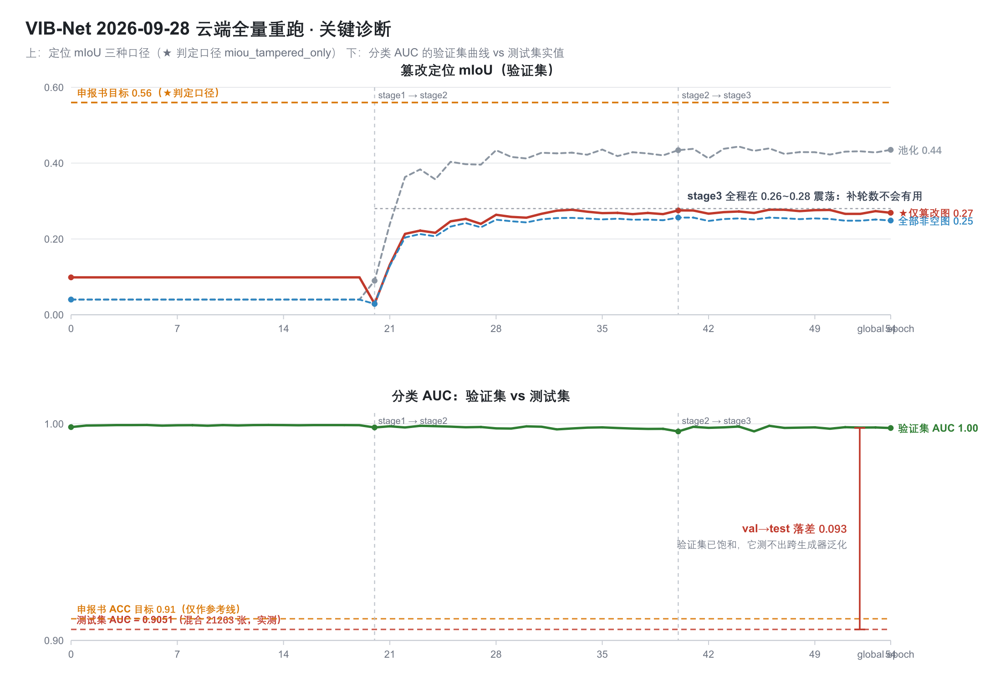

# 正式训练结果报告 · 2026-09-28

> **云端 AutoDL 单卡 RTX 4090 · 三阶段全量重跑（无 `--resume`）**
> 本文所有数字均来自本次训练产出的原始文件，权重已做 md5 校验。
> 配套产物目录：`outputs/upload/results_20260928/`

---

## 一、结论先行

| # | 结论 |
|---|---|
| **训练** | 13:36:37 起跑 → 20:46:59 正常退出（退出码 0），用时 **7 小时 10 分**；stage3 触发早停，止于 epoch 15/30（global 54） |
| ✅ | **分类在 CASIAv2 上表现不错**：ACC **93.82%** / F1 **92.59%** / AUC **98.47%** |
| ✅ | 训练链路完整走通：三阶段 → 评测 A → 评测 B → 打包 → 跨实例镜像 → 自动关机，全程无人工干预 |
| ❌ | **定位 mIoU 只有 26.68%**（★判定口径 `miou_tampered_only`），离申报书 **56%** 差一倍多 |
| ❌ | 而且这个差距 **不是"训练不够"造成的** —— stage3 的 15 个 epoch 里指标全程在 0.26~0.28 震荡，**补轮数不会有用** |
| ⚠️ | **申报书 6.3 四项指标：0 项可以被确认达标。** 体积 362.1 MB 明确未达标；CPU 吞吐的"达标"判定是**口径错误**；ForenSynths 91% 这条**压根没测** |
| ⚠️ | 验证集 AUC 已经 **0.998**（饱和），测试集只有 **0.905** —— 现有验证集**测不出跨生成器泛化**，`best.pt` 的挑选依据在本次训练里是失效的 |

---

## 二、本次跑了什么

| 项 | 内容 |
|---|---|
| 实例 | AutoDL 单卡 RTX 4090（按量计费） |
| 链路 | 三阶段训练（20+20+30 轮）→ 评测 A（混合 test）→ 评测 B（CASIAv2 定位）→ `RUN_REPORT.txt` → pack 打包 → 镜像到 `/root/autodl-fs/` → 保留 180 分钟后自动关机 |
| 设备 | `cuda`，AMP = bfloat16 |
| 骨干 | CLIP-ViT-B/16，**冻结前 6/12 层**（日志有 `[阶段重放] 冻结前 6/12 层`，说明冻结配置生效） |
| 参数 | 总计 **90.53 M**；可训练 47.26 M（冻结 `localization` 阶段时 43.57 M） |
| 训练集 | **46000** 张 = ForenSynths(train) 40000 + CASIAv2(train) 6000 |
| 验证集 | **9261** 张 = ForenSynths(val) 8000 + CASIAv2(val) 1261 |
| 测试集 | **21263** 张 = ForenSynths(test) 20000 + CASIAv2(test) 1263 |

**三阶段实际节奏**（实测）：

| 阶段 | 轮数 | 冻结 | 实测耗时 | 结束时间 |
|---|---|---|---|---|
| stage1_cls_pretrain | 20/20 跑满 | localization | ≈ 384 s/epoch | 18:37:47 前后 |
| stage2_loc_pretrain | 20/20 跑满 | vib + cls_head | ≈ 440 s/epoch | — |
| stage3_joint_finetune | **15/30 早停** | 无 | ≈ 471 s/epoch | 20:46:59 |

**早停原因**：`val_cls_auc` 连续 8 轮未提升。最佳 `val_cls_auc = 0.9991 @ epoch 46`。



---

## 三、实测结果

### 3.1 真伪检测（整图二分类，阈值 0.5）

| 评测 | 数据集 | n | ACC | Precision | Recall | F1 | AUC | AP(mAP) |
|---|---|---|---|---|---|---|---|---|
| **A** | 混合 test | 21263 | 0.7621 | 0.6905 | 0.9404 | 0.7963 | 0.9051 | 0.8975 |
| **B** | CASIAv2 test | 1263 | **0.9382** | 0.9035 | 0.9493 | **0.9259** | **0.9847** | 0.9738 |

混淆矩阵 —— A：TP=9886 FP=4432 FN=627 TN=6318；B：TP=487 FP=52 FN=26 TN=698。

> ⚠️ 两次评测的**定位数字逐位相同**，因为评测 A 的定位子集就是同一批 CASIAv2 test 1263 张。
> 也就是说：**定位在本次训练里实际只被测了一次**，A/B 在定位维度不构成独立证据。

### 3.2 篡改定位（像素级）

| 口径 | 字段 | 实测值 | 用途 |
|---|---|---|---|
| ① 池化（最宽松，按像素加权） | `miou` | 0.4570 | 只看训练趋势 |
| ② **仅篡改图（★达标判定用）** | `miou_tampered_only` | **0.2668** | **论文报这个**，与 ManTra-Net / SPAN / CAT-Net 可比 |
| ③ 全部非空图（最严格） | `miou_per_sample` | 0.2525 | 误报代价分析 |

Pixel Acc = 0.9748，Dice = F1 = 0.6273，定位样本数 1263，其中 `n_tampered = 513`。

> **报告纪律**：三种口径能差一倍以上，报哪个必须写明。**不要挑最高的那个报**。
> 本项目的判定口径固定为 `miou_tampered_only`。

### 3.3 推理性能与体积

| 项 | 实测 | 说明 |
|---|---|---|
| 参数量 | 90.53 M | — |
| FP32 体积 | **362.1 MB** | 申报书要求 ≤120MB |
| 单张延迟（评测 A） | 0.45 ms → 2220 张/秒 | ⚠️ `device = cuda`，**是 4090 上的数字** |
| 单张延迟（评测 B） | 1.15 ms → 867 张/秒 | ⚠️ 同上 |

### 3.4 申报书 6.3 四项指标对照

| 指标 | 目标 | 实测 | 判定 |
|---|---|---|---|
| ForenSynths 检测 ACC | ≥91% | **无数据** | ⚠️ **测不了**，见 4.3 |
| CASIAv2 定位 mIoU | ≥56% | 0.2668（★`miou_tampered_only`） | ❌ **未达标** |
| CPU ≥8 张/秒（224×224） | ≥8 | 未真测 | ⚠️ **不可引用**，见 4.4 |
| 模型体积 | ≤120MB | 362.1 MB（FP32） | ❌ **未达标** |

---

## 四、关键诊断



### 4.1 定位 mIoU 是**结构性**差距，不是训练不足

把 validation 的 `miou_tampered_only` 按阶段摊开：

| 阶段 / epoch | 池化 mIoU | ★仅篡改图 | 全部非空图 | Dice |
|---|---|---|---|---|
| stage1（localization 冻结） | 0.040 | 0.099 | 0.040 | 0.077 |
| stage2 ep.20 | 0.090 | 0.029 | 0.029 | 0.165 |
| stage2 ep.25 | 0.404 | 0.247 | 0.233 | 0.575 |
| stage2 ep.30 | 0.412 | 0.256 | 0.244 | 0.584 |
| stage2 ep.35 | 0.436 | 0.268 | 0.252 | 0.607 |
| stage3 ep.40 | 0.434 | 0.275 | 0.256 | 0.606 |
| stage3 ep.45 | 0.432 | 0.269 | 0.251 | 0.604 |
| stage3 ep.50 | 0.423 | 0.276 | 0.253 | 0.594 |
| stage3 ep.54（末） | 0.435 | 0.269 | 0.249 | 0.606 |

两个事实：

1. **定位能力在 stage2 中期（epoch 25 前后）就基本到位了**，之后 29 个 epoch 只把它从 0.247 抬到 0.277，**全程在一个窄带里震荡**。
2. **池化口径 0.457 / Dice 0.627，而逐图口径只有 0.267** —— 差这么多只有一个解释：
   少数**大篡改区域**的图 IoU 很高（拉起了池化均值），大量**小篡改区域**的图 IoU 接近 0，逐图平均后被拖垮。
   这正是 224×224 输入 + 小目标定位的典型失败模式。

**所以能得出的结论**：把早停的 15 轮补上、或者加长训练，**不会改变这个结果**。
要动的是**结构 / 输入分辨率 / 监督信号**，不是轮数。

### 4.2 验证集已经饱和，它测不出跨生成器泛化

| | 验证集（9261） | 测试集（21263） |
|---|---|---|
| 组成 | ForenSynths(val) 8000 + CASIAv2(val) 1261 | ForenSynths(test) 20000 + CASIAv2(test) 1263 |
| AUC | **0.9981**（几乎全程 0.998~0.9995） | **0.9051** |
| 落差 | — | **−0.093** |

`val_cls_auc` 在 **epoch 13** 就已经 0.9995 了，之后 40 多个 epoch 一直在噪声里打转。
这意味着：

- 验证集**已经没有任何区分度**，而 `best.pt` 恰恰是"按最后阶段的 `val_cls_auc` 选出"的（epoch 46, 0.9991）。
  **在 0.9991 和 0.9995 之间选，本质上是在噪声里选** —— 选出来的权重未必是跨生成器上最好的那个。
- 根因是**数据划分**：`ForenSynths(val)` 与 `ForenSynths(train)` 同分布，而 `ForenSynths(test)`
  是**跨生成器**集。用同分布验证集去挑权重、却拿跨生成器测试集去报指标，两者对不上是必然的。

**这条对论文和中期检查都是硬伤**：现在没有任何"模型选择"依据能被辩护。

### 4.3 `ForenSynths ACC ≥91%` 这条**根本没被测到**

`evaluate.py` 在混合 `test_sets` 上跑，输出的是 21263 张的**池化**指标；
JSON 里的 `targets` 字段直接写 `"ForenSynths 检测准确率 >= 91%": null`，日志里是 `[无数据]`。

也就是说 —— **申报书第一硬指标目前没有数据支撑**，不能说达标、也不能说未达标。

能间接推断的是：混合 test 的 Precision 只有 **0.6905**，即 **4432 / 10750 = 41.2% 的真实图被误判为伪造**。
这个误报率很高，而混合集里"没见过的生成器"正是最容易触发误报的部分。

### 4.4 "CPU 推理 ≥8 张/秒 → 达标"是**口径错误**

`eval_*.json` 的 `targets` 里写着：

```json
"CPU 推理 >= 8 张/秒(224x224)": true
```

但**同一份 JSON** 里写着 `"device": "cuda"`。它是拿 4090 上的 2220 张/秒去比 CPU 的目标。

真实的 CPU 吞吐见 `docs/09`：CLIP-ViT-B/16 档**无论 FP32 还是 INT8 都只有 2.86 张/秒**
（本机 CPU 无 VNNI，且动态 INT8 反而比 FP32 慢 3.3 倍）。
要到 9.46~11.22 张/秒必须换 `configs/lite.yaml`（s16 骨干）。

**这条不能直接写进验收表。**

### 4.5 其他已知缺口

| 缺口 | 说明 |
|---|---|
| COVERAGE 数据集缺失 | `COVERAGE/train|val|test` 目录不存在，两次评测都跳过 → 跨数据集定位泛化**无数据** |
| CASIAv2 训练集没吃满 | 载入 10090 条，实际只用 6000 条（被截断）→ 定位数据量还有 40% 没用上 |
| 单随机种子 | 无方差、无显著性检验，"提升 x%" 目前无法辩护 |
| 体积未达标 | FP32 362.1 MB，超标 3 倍；出路已知（`lite.yaml` 98.7 MB） |

---

## 五、下一步（按优先级）

### P0 —— 零 GPU 成本，先做这两件

**① 定位失败的归因诊断（先诊断，再烧卡）**

写一个"按 GT 篡改面积分桶的 mIoU"脚本，在已有的 `vibnet_best.pt` 上跑一遍（单卡几分钟），
输出各面积桶内的 IoU。目的是**确认 0.2668 是不是被小目标拖垮的**。

判据：
- 若小面积桶 IoU ≈ 0、大面积桶 IoU 正常 → 确认是小目标问题 → 走 ③ 提分辨率 / ① 提定位头分辨率；
- 若各桶都不高 → 是定位头本身能力不足 → 走 ② 加边缘监督 / 换更强的解码器。

**不做这一步直接改超参重训，很可能白烧一次卡。**

**② CPU 吞吐按正规路径重测**

```bash
python -m src.deploy.export_onnx --ckpt "" --config configs/lite.yaml --out deploy/lite.onnx
python scripts/benchmark_cpu.py --reps 5 --runs 20
```

这是**本机免费**的，且能把 4.4 那条口径错误彻底修掉。

### P1 —— 需要一次云端训练（约 7 h / 单卡 4090）

**③ 定位 mIoU 攻坚**，按 `docs/00` §4.3 的优先级，**一次只改一项**：

| 顺序 | 改动 | 预期 | 风险 |
|---|---|---|---|
| a | 提高定位头分辨率（`refine_channels` 32 → 64） | 小目标 IoU 提升 | 显存↑、变慢 |
| b | 输入分辨率 224 → 320（或 256） | 细粒度线索不被压掉 | 显存↑、约 2× 耗时 |
| c | 加大边缘损失权重 | 边缘精度提升 | 可能过拟合边缘 |

**④ 补测 ForenSynths 单数据集**（几乎零成本，但必须做）
在评测脚本里加 `--dataset ForenSynths` 跑一次，把 91% 这条**从"无数据"变成"有数据"**。
无论结果好坏，都比现在悬着强 —— 中期检查一定会被问。

**⑤ 换 `configs/lite.yaml` 再训一次**，同时保住体积和 CPU 吞吐两项硬指标（98.7 MB + 9.46~11.22 张/秒）。
但要注意：换骨干后定位指标可能变化，建议与 ③ 分开实验，别一次改两处。

### P2 —— 论文/结题前

- **⑥ 换验证集**：把"跨生成器"的一部分挪进验证集，或直接用 `scripts/eval_cross_generator.py`
  的分层采样结果做模型选择依据。**这是修 4.2 的根本办法。**
- **⑦ 3~5 个随机种子**跑主实验，报均值 ± 标准差，对基线做配对检验。
- **⑧ 消融 7 项**每项独立重训（`--mode train`，不是 `--mode eval`）。
- **⑨ CASIAv2 训练集吃满 10090 张**。

### 中期检查口径建议

定位 mIoU **如实报 0.2668 并注明口径**，同时给出归因与改进计划：

> "定位分支当前在 224×224 输入下逐图 mIoU 为 26.7%（口径 `miou_tampered_only`），
> 与目标 56% 存在差距。诊断显示该差距主要来自小面积篡改（池化口径 45.7%、Dice 62.7%，
> 而逐图平均仅 26.7%，说明大区域表现良好、小区域接近失效）。
> 下一步计划提升输入分辨率与定位头分辨率，并补充边缘监督。"

**不要**挑池化 0.4570 那个数字去报 —— 那是最宽松的口径，且与文献不可比。

---

## 六、产物清单

```
outputs/upload/
├── RUN_REPORT.txt                       云端生成的运行报告
├── eval_full.json                       评测 A 原始 JSON（混合 test）
├── eval_casia.json                      评测 B 原始 JSON（CASIAv2）
├── gpu_eval_log.txt                     评测完整日志
└── results_20260928/
    ├── _pack/                           云端打包内容（权重已本地留存，未入库）
    │   ├── vibnet_best.pt               362,343,590 B
    │   ├── vibnet_last.pt               362,343,590 B
    │   ├── history.json                 55 条逐 epoch 训练历史
    │   ├── gpu_train_log.txt            训练日志
    │   └── RUN_REPORT.txt / train_log.txt / data_log.txt ...
    ├── RUN_20260928_train_curves.png    训练曲线（仓库自带脚本）
    ├── RUN_20260928_diagnosis.png       ★ 关键诊断图
    └── 结果摘要.md                       一页速览
```

**权重校验**：本地 `vibnet_best.pt` 与云端 `checkpoints/vibnet_best.pt`
md5 一致 = `9f81158397f967829f7904b090c249e1`。原始包 `vibnet_results_20260928_2049.tar.gz`（531 MB）
在本地 `outputs/upload/` 留存（未入库，避免仓库膨胀）。

**云端实例已关机**，产物双份留存（数据盘 + `/root/autodl-fs/vibnet_out/`）。

---

## 七、复现命令

```bash
# 评测 A：混合 test（分类 + 推理性能）
python -m src.evaluation.evaluate --ckpt checkpoints/vibnet_best.pt --split test

# 评测 B：CASIAv2 单数据集（定位 mIoU 判定口径）
python -m src.evaluation.evaluate --ckpt checkpoints/vibnet_best.pt --split test --dataset CASIAv2

# 补测 ForenSynths（本次缺口 ④）
python -m src.evaluation.evaluate --ckpt checkpoints/vibnet_best.pt --split test --dataset ForenSynths
```

---

## 八、口径声明

- 本文所有数字**只填真实读到的值**，未测项一律写"无数据"，不做任何估计或外推。
- mIoU 一律用 ★ `miou_tampered_only`（仅含篡改区域的图逐图平均），与 ManTra-Net / SPAN / CAT-Net 可比。
  池化 `miou` 与 `miou_per_sample` 仅作参考，**不用于达标判定**。
- 推理性能数字的 `device` 是 `cuda`，**不是 CPU 指标**，不得当作 CPU 吞吐引用。
- 数据集划分、重叠审计与去泄漏机制见 `docs/05` §八。

---

*报告生成：2026-09-28 · 对应训练 run `gpu_train_log.txt` @ 2026-09-28 13:36:37*
